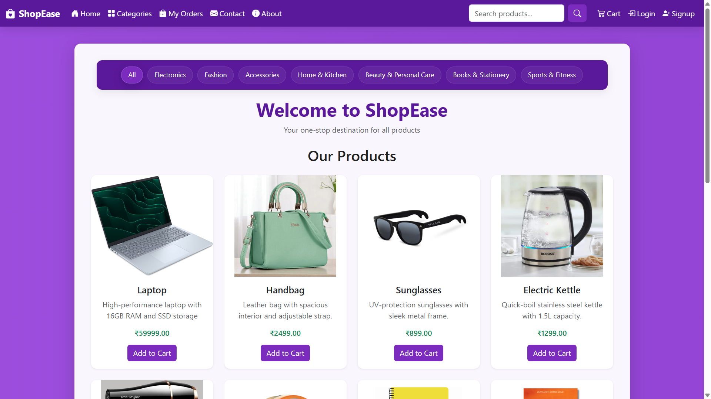
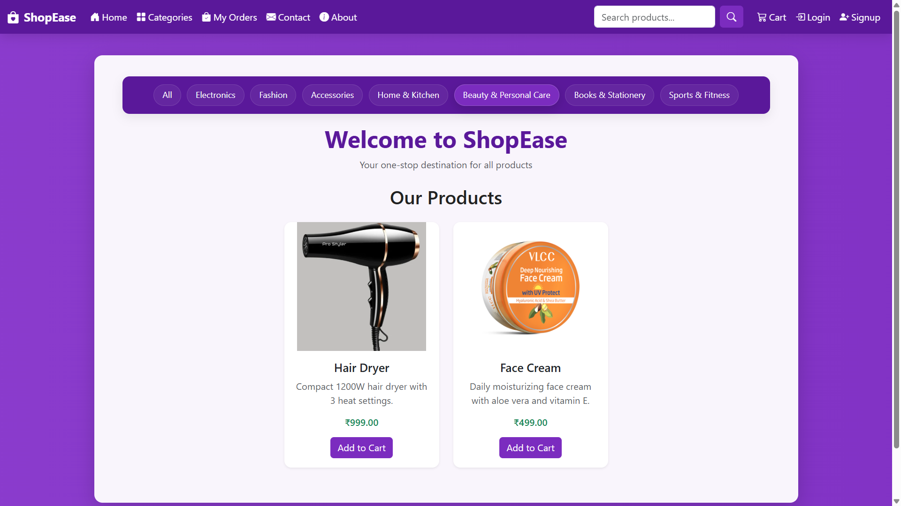
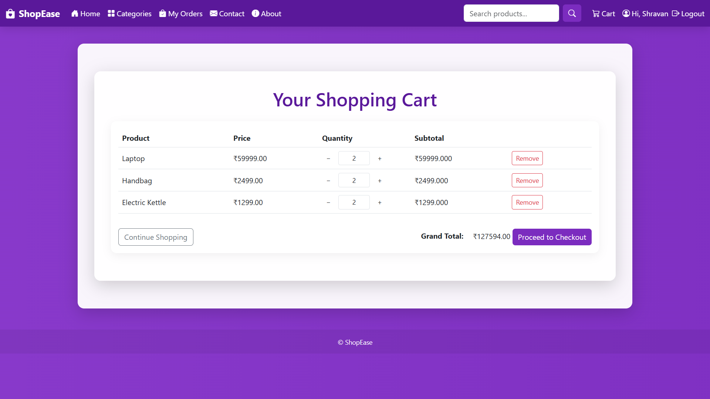
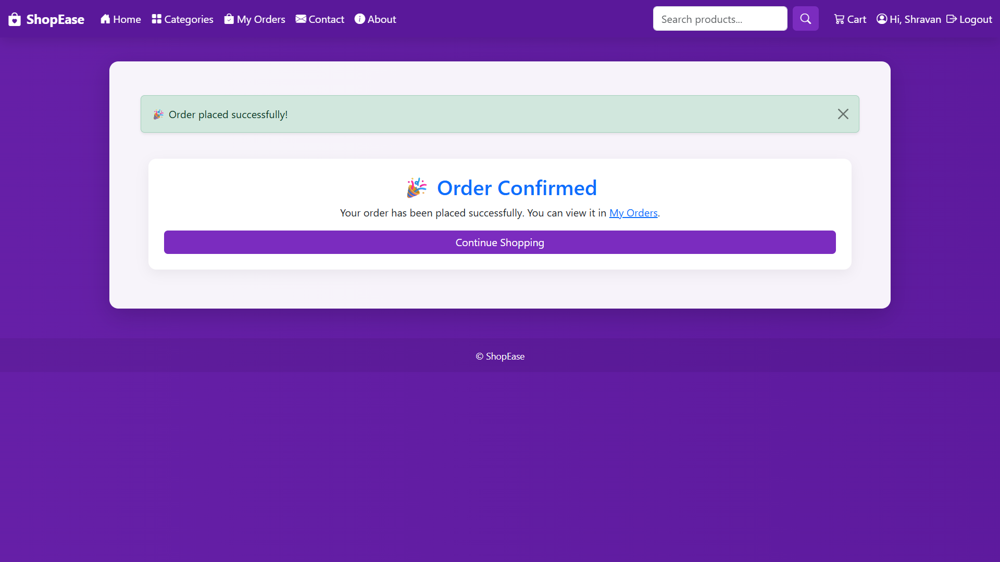
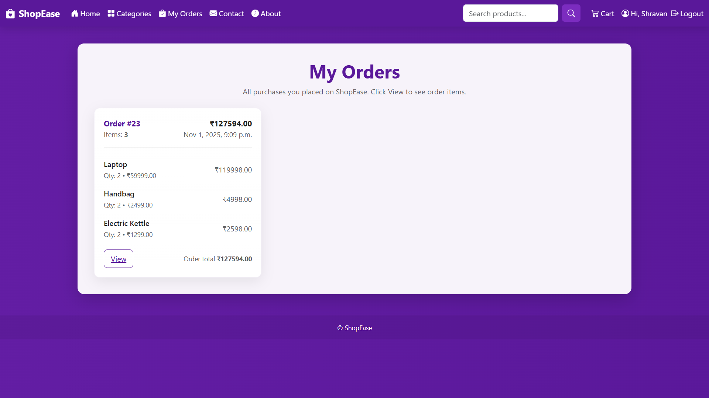
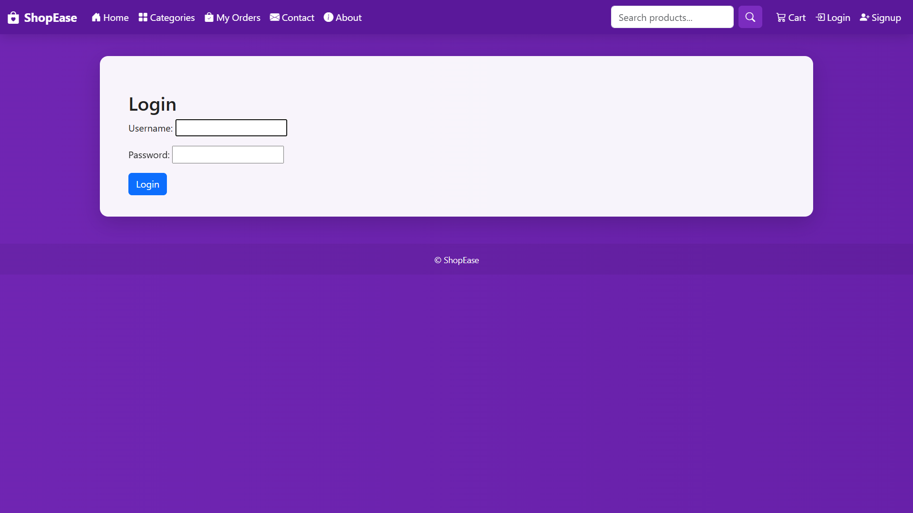

# 🛍️ ShopEase – E-Commerce Website 

## 🔗 **GitHub Repository**

👉 [**ShopEase GitHub Repo**](https://github.com/KaranCodes04/ShopEase.git)

---

## 💡 **Project Overview**

ShopEase is a Django-based mini e-commerce web application that demonstrates user authentication, product categorization, a functional shopping cart, and a checkout system.
The project is built using Python and Django and focuses on implementing CRUD operations, database interaction, and UI design.

---

## 🚀 **Features Implemented**

✅ **User Authentication (in-built app)**

* Users can **sign up, log in, and log out** using Django’s built-in `User` model.
* Authentication is required for checkout and order history.

✅ **Shopping Cart (Model + Session)**

* Add products to the cart (works for both guest and logged-in users).
* Update quantity using `+` and `−` buttons.
* Remove products from cart individually.

✅ **UI & Styling**

* Modern, responsive **purple-themed interface**.
* Bootstrap integrated with custom CSS animations.
* Toast notifications on adding products to the cart.

✅ **Product Categories**

* Category-based product filtering (Electronics, Fashion, Beauty, etc.).
* “All” button to view all products in a single view.

✅ **Ordering System (Checkout)**

* Checkout creates real **Order** and **OrderItem** entries in the database.
* My Orders page displays all past orders with date and total.

✅ **Guest Cart Support**

* Guests can add items before logging in; items persist until cleared.

---

## 🧠 **Concepts & Technologies Used**

| Concept                    | Description                                             |
| -------------------------- | ------------------------------------------------------- |
| **Django Framework**       | MVC-based Python web framework                          |
| **Django ORM**             | For database CRUD operations                            |
| **User Authentication**    | Login, Logout, Registration                             |
| **Models & Relationships** | `Product`, `Category`, `CartItem`, `Order`, `OrderItem` |
| **Templates**              | Dynamic HTML rendering with Django template tags        |
| **Bootstrap 5**            | Responsive and elegant UI                               |
| **AJAX (Fetch API)**       | Real-time cart updates without page reload              |
| **SQLite**                 | Default lightweight database                            |
| **Session Management**     | Handling guest carts                                    |
| **CSRF & Security**        | Built-in Django protections                             |

---

## 🧩 **Architecture / Schema**

ShopEase follows the **Django MVT (Model–View–Template)** architecture pattern which separates the application into three main layers:

* **Model:** Defines the database structure and handles data (e.g., Product, Category, Cart, Order).
* **View:** Contains the business logic and controls how data is displayed.
* **Template:** Manages the front-end and user interface using HTML, CSS, and Bootstrap.

---

### **📁 Project Folder Structure**

```
ShopEase/
│
├── ecommerce_webapp/              # Project configuration files
│   ├── settings.py                # Installed apps and database setup
│   ├── urls.py                    # Global URL mappings
│
├── store/                         # Main app
│   ├── models.py                  # Models for Category, Product, Cart, Order
│   ├── views.py                   # Handles logic for cart, checkout, orders
│   ├── urls.py                    # URL routes for store
│   ├── templates/store/           # HTML templates
│   │   ├── base.html
│   │   ├── product_list.html
│   │   ├── cart.html
│   │   ├── orders.html
│   │   └── checkout_success.html
│   ├── static/store/              # CSS, JS, and images
│
├── db.sqlite3                     # Database file
├── manage.py                      # Django management tool
└── requirements.txt               # List of dependencies
```

---

### **🔁 Data Flow Diagram**

```
User → View → Model → Database → View → Template → User
```

**Explanation:**

1. The user requests a page (like viewing products or adding to cart).
2. The **View** receives the request and interacts with the **Model**.
3. The **Model** fetches or updates data from the **Database**.
4. The **View** passes the data to the **Template**.
5. The **Template** renders a webpage shown back to the **User**.

---

### **🗄 Database Schema (Models Overview)**

```
Category (id, name)
    ↓
Product (id, name, description, price, category_id, image)
    ↓
CartItem (id, user_id, product_id, quantity)
    ↓
Order (id, user_id, total, created_at)
    ↓
OrderItem (id, order_id, product_id, quantity, price)
```

---

✅ **In summary:**
ShopEase is designed with modular Django architecture ensuring clear data flow between user interface, backend logic, and database for efficient e-commerce functionality.

---

## 🧑‍💻 **Team & Contributions**

| Name              | Roll No | Contribution                                                                                                         |
| ----------------- | ------- | -------------------------------------------------------------------------------------------------------------------- |
| **Karan Shelar**  | 357     | Full project development (models, views, templates, authentication, cart, UI, checkout, GitHub setup, documentation) |
| **Pranav Bobade** | 360     | Testing, category structure input, suggestions for UI, documentation assistance                                      |

---

## 🖼️ Screenshots

### 🏠 Home Page


### 🧩 Category Filter


### 🛒 Cart Page


### 💳 Checkout / Order Success


### 📦 My Orders Page


### 🔐 Login Page


---

## ⚙️ **How to Run the Project**

1. **Clone the repository**

   ```bash
   git clone https://github.com/KaranShelar357/ShopEase.git
   cd ShopEase
   ```

2. **Create Virtual Environment & Activate**

   ```bash
   python -m venv .venv
   .\.venv\Scripts\activate
   ```

3. **Install Dependencies**

   ```bash
   pip install -r requirements.txt
   ```

4. **Run Migrations**

   ```bash
   python manage.py makemigrations
   python manage.py migrate
   ```

5. **Create Superuser**

   ```bash
   python manage.py createsuperuser
   ```

6. **Run Server**

   ```bash
   python manage.py runserver
   ```

7. **Open Browser**

   * Go to **[http://127.0.0.1:8000/](http://127.0.0.1:8000/)**

---

## 🧩 **Challenges Faced**

* Implementing add-to-cart for both logged-in and guest users
* Managing product quantities dynamically using Fetch API (AJAX)
* Aligning Django messages and toast notifications
* Integrating category-based filters dynamically
* Designing an elegant responsive purple theme

---

## 🔮 **Future Improvements**

* Add payment gateway integration (Razorpay / PayPal sandbox)
* Add product search with autocomplete
* Add user profile and shipping address
* Add reviews and ratings
* Implement product recommendations

---

## 📘 **Concepts Learned & Applied**

* Django Models, Views, and Templates (MVT pattern)
* ORM queries for CRUD operations
* Template tags and filters (``, ``)
* Python list comprehension in order calculations
* Session handling for guest carts
* CSRF protection & JSON API integration
* Git & GitHub version control
* Collaboration using commits and branching

---

## 🏁 **Final Outcome**

✅ Fully functional **E-commerce website (ShopEase)**
✅ Implements all features as per the Mini Project instructions
✅ Ready for cloning and testing on any machine
✅ Proper documentation and GitHub link provided

---


